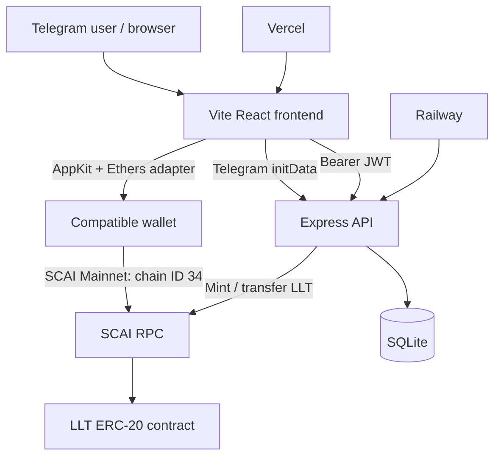

# SCAI Lucky Loop

SCAI Lucky Loop is a Telegram Mini App for a daily, coin-based lottery. Players authenticate with Telegram, earn in-app coins, buy ticket slots, review draw results, and withdraw eligible rewards as **LLT** tokens on **SCAI Mainnet**.

The repository contains three deployable parts:

| Directory | Responsibility | Deployment |
| --- | --- | --- |
| `frontend/` | Vite + React client and wallet connection | Vercel |
| `backend/` | Express API, SQLite data store, jobs and withdrawals | Railway |
| `contracts/` | LLT ERC-20 Solidity contract and Hardhat tests | SCAI Mainnet |

## Current architecture



Important: tickets are currently bought with in-app coins. Connecting a wallet lets a player supply a SCAI-compatible address for LLT withdrawals; it does not yet make an on-chain SCAI payment for tickets.

## Features

- Telegram-authenticated account and JWT session
- Daily coin rewards, referral tracking, ticket purchase and account history
- Scheduled commit-reveal lottery draws
- On-chain LLT withdrawal to a connected or manually entered EVM address
- Reown AppKit connection flow for MetaMask, Trust Wallet, Coinbase Wallet, and WalletConnect-compatible wallets
- SCAI Mainnet as the required/default wallet network
- Vercel single-page-app routing, including direct links and browser Back navigation

## SCAI network

| Setting | Value |
| --- | --- |
| Network | SCAI Mainnet |
| Chain ID | `34` |
| Currency | `SCAI` |
| RPC | `https://mainnet-rpc.scai.network` |
| Explorer | `https://explorer.securechain.ai` |
| LLT contract | `0x290483A8fC8ed76647dA75260eb2a2594B5330a2` |

When a wallet reconnects, the client requests a switch to SCAI Mainnet. Approve the wallet prompt if the network has not already been added.

## Run locally

Prerequisites: Node.js 18+ and npm. Telegram sign-in itself requires opening the app through Telegram with a configured bot.

1. Start the API:

   ```bash
   cd backend
   npm install
   cp .env.example .env
   npm run init-db
   npm run dev
   ```

2. In a second terminal, start the frontend:

   ```bash
   cd frontend
   npm install
   npm run dev
   ```

3. Open the local Vite URL printed by the terminal (normally `http://localhost:5173`).

## Environment variables

### Frontend

Create `frontend/.env.local` for local use. All browser-visible Vite values must begin with `VITE_`.

```dotenv
VITE_API_URL=http://localhost:3000
VITE_RPC_URL=https://mainnet-rpc.scai.network
VITE_CONTRACT_ADDRESS=0x290483A8fC8ed76647dA75260eb2a2594B5330a2
VITE_CHAIN_ID=34
VITE_EXPLORER_URL=https://explorer.securechain.ai
VITE_REOWN_PROJECT_ID=your_reown_project_id
```

`VITE_REOWN_PROJECT_ID` is required to enable wallet connection. Without it, the rest of the app continues to load and the withdrawal screen explains that wallet setup is unavailable.

### Backend

Copy `backend/.env.example` to `backend/.env`. At minimum set:

```dotenv
JWT_SECRET=use_a_long_random_value
TELEGRAM_BOT_TOKEN=botfather_token
ADMIN_TELEGRAM_IDS=comma_separated_telegram_ids
RPC_URL=https://mainnet-rpc.scai.network
LLT_CONTRACT_ADDRESS=0x290483A8fC8ed76647dA75260eb2a2594B5330a2
BACKEND_PRIVATE_KEY=funded_wallet_with_LLT_mint_permission
```

Never commit backend secrets or private keys.

## Deployment

### Frontend on Vercel

`vercel.json` builds `frontend/` and publishes `frontend/dist`. It also rewrites all paths to `index.html`, which is required for React Router routes such as `/login`, `/home`, and `/withdraw`.

Set these variables in Vercel for **Production** and **Preview**, then redeploy:

```dotenv
VITE_API_URL=https://lotteryproject-production.up.railway.app
VITE_RPC_URL=https://mainnet-rpc.scai.network
VITE_CONTRACT_ADDRESS=0x290483A8fC8ed76647dA75260eb2a2594B5330a2
VITE_CHAIN_ID=34
VITE_EXPLORER_URL=https://explorer.securechain.ai
VITE_REOWN_PROJECT_ID=your_reown_project_id
```

Vite substitutes these values during the build. Changing a Vercel variable requires a new deployment.

### Backend on Railway

Railway uses the root `Procfile` to install and start `backend/`. Configure the backend environment variables in Railway, including the database path and all secrets, before deploying.

## Development commands

| Location | Command | Purpose |
| --- | --- | --- |
| `frontend/` | `npm run dev` | Start the Vite development server |
| `frontend/` | `npm run build` | Create a production build in `dist/` |
| `frontend/` | `npm run preview` | Serve the production build locally |
| `backend/` | `npm run dev` | Start Express with nodemon |
| `backend/` | `npm start` | Start Express normally |
| `backend/` | `npm run init-db` | Initialize SQLite data |

## Documentation

- [Architecture](./architecture.md) — runtime paths, trust boundaries, and operational notes
- [Frontend notes](./frontend/frontendREADME.md) — client-specific details
- [Backend notes](./backend/backendREADME.md) — API and service layout
- [Contract notes](./contracts/contractsREADME.md) — LLT contract and tests


l