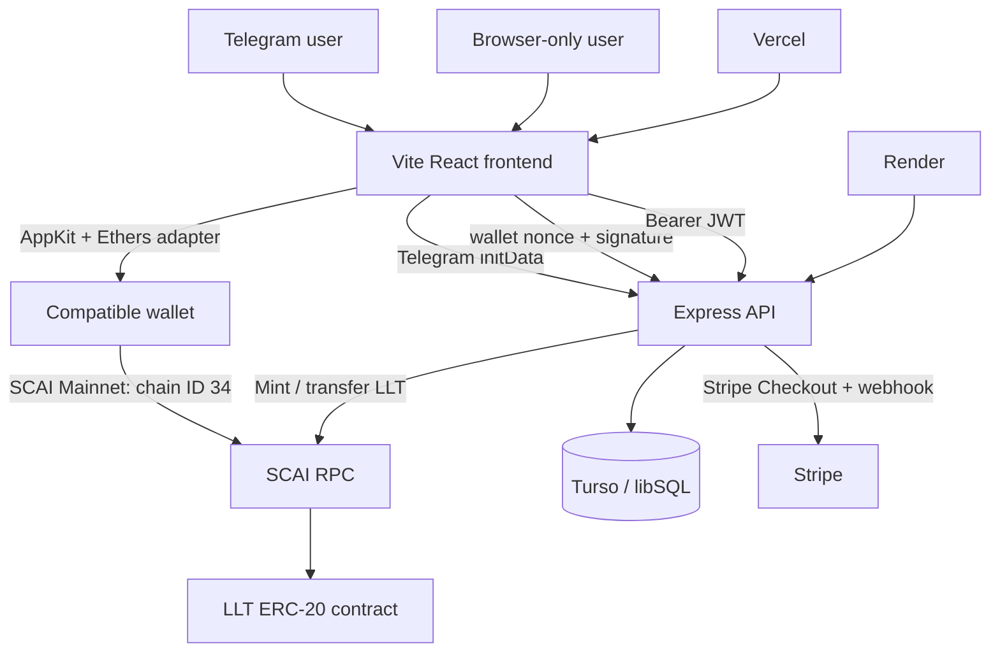

# SCAI Lucky Loop

SCAI Lucky Loop is a daily, coin-based lottery available as a Telegram Mini App and as a standalone browser SPA. Players earn in-app coins, buy ticket slots, review provably-fair draw results, and — once eligible — withdraw rewards as **LLT** tokens on **SCAI Mainnet**.

The repository contains three deployable parts:

| Directory | Responsibility | Deployment |
| --- | --- | --- |
| `frontend/` | Vite + React client, Telegram + wallet login, wallet connection | Vercel |
| `backend/` | Express API, Turso (libSQL) data store, jobs, withdrawals, payments | Render |
| `contracts/` | LLT ERC-20 Solidity contract and Hardhat tests | SCAI Mainnet |

## Current architecture


```mermaid
flowchart TD
  U[Telegram user] --> F[Vite React frontend]
  U2[Browser-only user] --> F
  F -->|Telegram initData| B[Express API]
  F -->|wallet nonce + signature| B
  F -->|Bearer JWT| B
  F -->|AppKit + Ethers adapter| W[Compatible wallet]
  W -->|SCAI Mainnet: chain ID 34| S[SCAI RPC]
  B --> D[(Turso / libSQL)]
  B -->|Mint / transfer LLT| S
  B -->|Stripe Checkout + webhook| P[Stripe]
  S --> C[LLT ERC-20 contract]
  V[Vercel] --> F
  Rn[Render] --> B
```

Important: **buying a ticket** is still an in-app coin transaction, not a direct on-chain payment. There are, however, two ways to top up your coin balance with real money: sending native SCAI on-chain to a treasury address (`/api/deposit`, verified against the chain before coins are credited), or a Stripe Checkout flow for fiat (`/api/stripe/*`). Connecting a wallet also supplies the payout address used for LLT withdrawals.

## Features

- Telegram-authenticated login (HMAC-verified `initData`) **and** a wallet-only login (nonce + signature, no Telegram account required)
- Daily coin rewards, referral tracking, ticket purchase and account history
- Scheduled commit-reveal lottery draws, independently verifiable by anyone
- Weekly jackpot pool with its own status/history/verification endpoints
- Two coin top-up paths: on-chain SCAI deposit to a treasury address, or Stripe Checkout for fiat
- On-chain LLT withdrawal to a connected or manually entered EVM address
- Admin panel (`/admin`) for user management, withdrawal approval, and manual draw control — access via Telegram ID allowlist, wallet allowlist, or an in-app-grantable `is_admin` flag
- Reown AppKit connection flow for MetaMask, Trust Wallet, Coinbase Wallet, and WalletConnect-compatible wallets
- SCAI Mainnet as the required/default wallet network
- Vercel single-page-app routing, including direct links and browser Back navigation

## SCAI network

| Setting | Value |
| --- | --- |
| Network | SCAI Mainnet |
| Chain ID | `34` |
| Currency | `SCAI` |
| RPC | `https://mainnet-rpc.scai.network` |
| Explorer | `https://explorer.securechain.ai` |
| LLT contract | `0x290483A8fC8ed76647dA75260eb2a2594B5330a2` |

When a wallet reconnects, the client requests a switch to SCAI Mainnet. Approve the wallet prompt if the network has not already been added.

## Run locally

Prerequisites: Node.js 18+ and npm. Telegram sign-in itself requires opening the app through Telegram with a configured bot — the wallet-only login path works from a plain browser instead.

1. Start the API:

   ```bash
   cd backend
   npm install
   cp .env.example .env
   npm run init-db
   npm run dev
   ```

2. In a second terminal, start the frontend:

   ```bash
   cd frontend
   npm install
   npm run dev
   ```

3. Open the local Vite URL printed by the terminal (normally `http://localhost:5173`).

## Environment variables

### Frontend

Create `frontend/.env.local` for local use. All browser-visible Vite values must begin with `VITE_`.

```dotenv
VITE_API_URL=http://localhost:3000
VITE_TELEGRAM_BOT_USERNAME=YourBotUsername_bot
VITE_RPC_URL=https://mainnet-rpc.scai.network
VITE_CONTRACT_ADDRESS=0x290483A8fC8ed76647dA75260eb2a2594B5330a2
VITE_CHAIN_ID=34
VITE_EXPLORER_URL=https://explorer.securechain.ai
VITE_REOWN_PROJECT_ID=your_reown_project_id
```

`VITE_REOWN_PROJECT_ID` is required to enable wallet connection (used for both wallet login and withdrawal payout addresses). Without it, the rest of the app continues to load and the wallet-dependent screens explain that wallet setup is unavailable.

### Backend

Copy `backend/.env.example` to `backend/.env`. At minimum set:

```dotenv
JWT_SECRET=use_a_long_random_value
TELEGRAM_BOT_TOKEN=botfather_token
ADMIN_TELEGRAM_IDS=comma_separated_telegram_ids
ADMIN_WALLET_ADDRESSES=comma_separated_lowercase_addresses
RPC_URL=https://mainnet-rpc.scai.network
LLT_CONTRACT_ADDRESS=0x290483A8fC8ed76647dA75260eb2a2594B5330a2
BACKEND_PRIVATE_KEY=funded_wallet_with_LLT_mint_permission
```

For the Stripe fiat deposit path, also set `STRIPE_SECRET_KEY` and `STRIPE_WEBHOOK_SECRET`. `ADMIN_TELEGRAM_IDS` / `ADMIN_WALLET_ADDRESSES` are the bootstrap admin allowlists — once at least one admin exists, further admins can be granted in-app via the `/admin` panel without touching env vars (see [architecture.md](./architecture.md#admin-access)).

Never commit backend secrets or private keys.

## Deployment

### Frontend on Vercel

`vercel.json` builds `frontend/` and publishes `frontend/dist`. It also rewrites all paths to `index.html`, which is required for React Router routes such as `/login`, `/home`, `/withdraw`, and `/admin`.

Set these variables in Vercel for **Production** and **Preview**, then redeploy:

```dotenv
VITE_API_URL=https://<your-render-service>.onrender.com
VITE_RPC_URL=https://mainnet-rpc.scai.network
VITE_CONTRACT_ADDRESS=0x290483A8fC8ed76647dA75260eb2a2594B5330a2
VITE_CHAIN_ID=34
VITE_EXPLORER_URL=https://explorer.securechain.ai
VITE_REOWN_PROJECT_ID=your_reown_project_id
```

Vite substitutes these values during the build. Changing a Vercel variable requires a new deployment.

### Backend on Render

The backend is deployed as a Render web service running `backend/`. Configure all backend environment variables (secrets, Turso database URL/token, admin allowlists, Stripe/RPC keys) directly in the Render dashboard before deploying. Render assigns the service its own public URL — that's what `VITE_API_URL` above should point to.

## Development commands

| Location | Command | Purpose |
| --- | --- | --- |
| `frontend/` | `npm run dev` | Start the Vite development server |
| `frontend/` | `npm run build` | Create a production build in `dist/` |
| `frontend/` | `npm run preview` | Serve the production build locally |
| `backend/` | `npm run dev` | Start Express with nodemon |
| `backend/` | `npm start` | Start Express normally |
| `backend/` | `npm run init-db` | Initialize database schema on Turso |

## Documentation

- [Architecture](./architecture.md) — runtime paths, trust boundaries, and operational notes
- [API reference](./Api.md) — every route, request/response shape, and rate limit
- [Project documentation](./PROJECT_DOCUMENTATION.md) — player flow, fairness model, admin model
- [Frontend notes](./frontend/frontendREADME.md) — client-specific details
- [Backend notes](./backend/backendREADME.md) — API and service layout
- [Contract notes](./contracts/contractsREADME.md) — LLT contract and tests

## Known repo housekeeping

A few loose ends worth cleaning up rather than treating as documentation gaps:

- ~~There's a stray, incomplete `Contact.tsx` at the repository root~~ — removed. The real, routed page remains at `frontend/src/pages/Contact.tsx`, untouched.
- `frontend/src/pages/Landing.tsx` and `frontend/src/pages/Rules.tsx` exist but aren't referenced by any route in `App.tsx`. `GameRules.tsx` is the page actually mounted at `/rules`. Either wire these in or remove them.