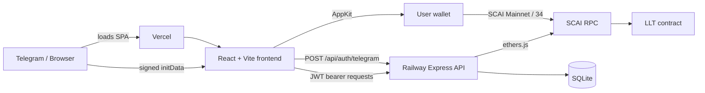
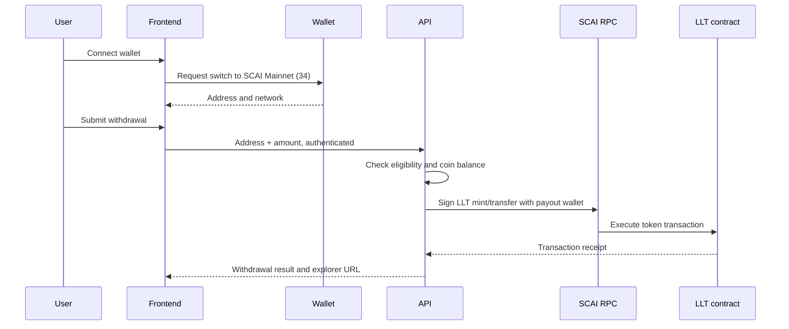

# SCAI Lucky Loop architecture

## System boundaries



## Frontend

The frontend is a Vite React application in `frontend/`.

- `src/index.tsx` loads CSS, initializes AppKit, and renders React.
- `src/App.tsx` owns client routes and protects authenticated pages.
- `src/api/client.ts` attaches the JWT and sends an expired session to `/login` after a `401`.
- `src/store/userStore.ts` persists the user and JWT in local storage.
- `src/hooks/` groups API actions by feature.
- `src/pages/` contains the login, home, tickets, draws, withdrawal, profile, leaderboard, and jackpot views.
- `src/appkit.tsx` declares SCAI Mainnet as the only configured AppKit network and as the default.
- `src/components/WalletConnect.tsx` requests a switch to chain ID `34` after a wallet connects.

AppKit uses the Ethers adapter. This supports EVM wallets; it is not restricted to Ethereum. The configured network's native currency is SCAI. The user must approve a wallet's add/switch-network request before it can operate on SCAI Mainnet.

The Vercel rewrite in `vercel.json` sends every client route to `index.html`. React Router then renders the right page. Without this rewrite, direct navigation and browser Back can lead to a static-host 404/blank view.

## Authentication path

1. Telegram launches the Mini App and exposes `window.Telegram.WebApp.initData`.
2. The client posts `initData` to `POST /api/auth/telegram`.
3. The backend verifies Telegram's signature using `TELEGRAM_BOT_TOKEN`.
4. The backend creates or loads the user and returns a JWT.
5. The client stores the JWT and submits it as `Authorization: Bearer <token>` to protected API calls.

Direct browser usage can render the login page, but a genuine production login must originate from Telegram because arbitrary browser sessions do not have Telegram's signed `initData`.

## Backend

The Express application is in `backend/src/`.

```text
HTTP request
  -> security middleware (Helmet, CORS, JSON parsing, global rate limiter)
  -> resource router
  -> auth / validation / route rate limiter where needed
  -> controller
  -> service
  -> SQLite or SCAI RPC
```

Services own business rules such as ticket limits, coin balances, referrals, withdrawals, draw scheduling, and commit-reveal verification. SQLite is the system of record for users, tickets, draws, transactions, and withdrawal history.

The API runs scheduled jobs for ticket-sale closing, seed commitment, drawing, and housekeeping. A completed draw can be verified through the public draw verification endpoint.

## Wallet and withdrawal path



The connected wallet is used to select the recipient address. The backend's configured payout key signs LLT contract calls. That key must remain a Railway secret and must have the required contract permissions.

## Deployment configuration

- **Vercel:** runs `cd frontend && npm install && npm run build`, publishes `frontend/dist`, and provides SPA rewrites and Telegram embedding headers.
- **Railway:** uses `Procfile` to run the backend.
- **SCAI Mainnet:** chain ID `34`, native SCAI currency, RPC `https://mainnet-rpc.scai.network`.

Frontend settings are build-time values. In Vercel they must use `VITE_` names; legacy `REACT_APP_*` keys are ignored by Vite.

## Security and operational notes

- Never expose `BACKEND_PRIVATE_KEY`, bot tokens, JWT secrets, or administrative IDs in frontend variables.
- `VITE_*` values are public in the browser bundle; do not put secrets in them.
- Current rate-limit counters and SQLite storage are local to a backend instance. Plan a shared limiter/database before scaling to multiple API instances.
- Ticket purchase remains off-chain and coin-based. Adding native-SCAI ticket payments requires an explicit payment/contract design and should not be inferred from wallet connection alone.
