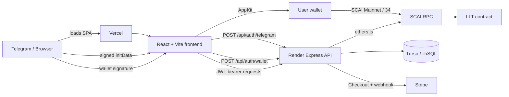
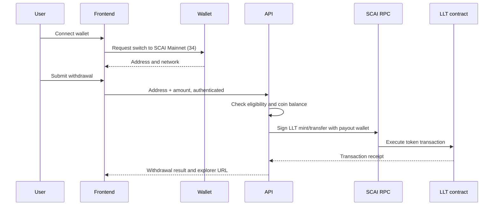

# SCAI Lucky Loop architecture

## System boundaries


```mermaid
flowchart LR
  T[Telegram / Browser] -->|loads SPA| V[Vercel]
  V --> F[React + Vite frontend]
  T -->|signed initData| F
  T -->|wallet signature| F
  F -->|POST /api/auth/telegram| A[Render Express API]
  F -->|POST /api/auth/wallet| A
  F -->|JWT bearer requests| A
  F -->|AppKit| M[User wallet]
  M -->|SCAI Mainnet / 34| R[SCAI RPC]
  A --> Q[(Turso / libSQL)]
  A -->|ethers.js| R
  A -->|Checkout + webhook| ST[Stripe]
  R --> L[LLT contract]
```

## Frontend

The frontend is a Vite React application in `frontend/`.

- `src/index.tsx` loads CSS, initializes AppKit, and renders React.
- `src/App.tsx` owns client routes and protects authenticated pages, including `/admin`.
- `src/api/client.ts` attaches the JWT and sends an expired session to `/login` after a `401`.
- `src/store/userStore.ts` persists the user and JWT in local storage.
- `src/hooks/` groups API actions by feature — `useAuth`, `useWalletAuth`, `useDeposit`, `useWithdraw`, `useTickets`, `useDraws`, `useBalance`.
- `src/pages/` contains login, home, tickets, draws, withdrawal, profile, leaderboard, jackpot, and the admin control panel.
- `src/appkit.tsx` declares SCAI Mainnet as the only configured AppKit network and as the default.
- `src/components/WalletConnect.tsx` requests a switch to chain ID `34` after a wallet connects.

AppKit uses the Ethers adapter. This supports EVM wallets; it is not restricted to Ethereum. The configured network's native currency is SCAI. The user must approve a wallet's add/switch-network request before it can operate on SCAI Mainnet.

The Vercel rewrite in `vercel.json` sends every client route to `index.html`. React Router then renders the right page. Without this rewrite, direct navigation and browser Back can lead to a static-host 404/blank view. The same principle applies to any route added to `App.tsx` — a page component existing in `src/pages/` does nothing until it's also registered as a `<Route>`; an unregistered route renders nothing at all rather than a helpful error.

## Authentication paths

There are two independent ways to obtain a session JWT:

**Telegram (primary path)**

1. Telegram launches the Mini App and exposes `window.Telegram.WebApp.initData`.
2. The client posts `initData` to `POST /api/auth/telegram`.
3. The backend verifies Telegram's signature using `TELEGRAM_BOT_TOKEN` (HMAC-SHA256, see `backend/src/utils/telegramAuth.js`).
4. The backend creates or loads the user and returns a JWT.
5. The client stores the JWT and submits it as `Authorization: Bearer <token>` to protected API calls.

Direct browser usage can render the login page, but a genuine Telegram-path login must originate from Telegram because arbitrary browser sessions do not have Telegram's signed `initData`. `POST /api/auth/telegram-browser` exists as a variant of the same verification for the browser-embedded case.

**Wallet-only (no Telegram account required)**

1. Client requests a one-time nonce for a specific address: `GET /api/auth/wallet/nonce`.
2. The connected wallet signs a message containing that nonce.
3. The client posts the signature to `POST /api/auth/wallet`.
4. The backend verifies the signature with `ethers.verifyMessage` (see `backend/src/utils/walletAuth.js`) and issues a JWT, creating the account if it doesn't exist yet.
5. `POST /api/auth/wallet/link` (authenticated) lets an existing Telegram-login account attach a wallet address after the fact, rather than only at signup.

This required the `users` table to allow a null `telegram_id` (a CHECK constraint enforces that at least one identity — Telegram or wallet — is present per row), since the original schema assumed every account had a Telegram identity.

## Backend

The Express application is in `backend/src/`.

```text
HTTP request
  -> security middleware (Helmet, CORS, JSON parsing, global rate limiter)
  -> resource router
  -> auth / validation / route rate limiter where needed
  -> controller
  -> service
  -> Turso or SCAI RPC or Stripe
```

Services own business rules such as ticket limits, coin balances, referrals, withdrawals, deposits, draw scheduling, jackpot accrual, and commit-reveal verification. Turso (libSQL, accessed via `@libsql/client`) is the system of record for users, tickets, draws, transactions, deposits, and withdrawal history. Unlike the earlier local-file `node:sqlite` setup, the database lives outside the app container, so it survives redeploys and free-tier host restarts instead of resetting.

The API runs scheduled jobs (`backend/src/jobs/lotteryCron.js`) for ticket-sale closing, seed commitment, drawing, and housekeeping. A completed draw can be verified through the public draw verification endpoint.

## Commit-reveal draw mechanism

1. When sales close for the day, the backend generates a random 32-byte seed and publishes only its SHA-256 hash (`server_seed_hash`) — the seed itself stays server-side.
2. At draw time, the seed is used to deterministically pick a winning ticket (`SHA-256(seed)` → first 4 bytes as an integer → modulo ticket count) and is then revealed.
3. `GET /api/draws/:date/verify` independently recomputes the hash from the revealed seed and checks it against what was published before the draw, and recomputes the winning ticket index the same way. Both checks are done by the caller's own trust, not the server's say-so — the endpoint is deliberately public and unauthenticated.

A day with zero ticket sales still gets a `draws` row created during the sales-close step (not only when a ticket is bought), so the draw job has something to close and mark "drawn, no winner" instead of failing outright on a quiet day.

## Payments: two ways to acquire coins

- **On-chain SCAI deposit** (`/api/deposit/*`): the client sends native SCAI to a treasury address returned by `GET /api/deposit/info`, waits for the transaction to be mined, then the backend independently verifies the transaction on-chain before crediting coins — it does not trust a client-submitted tx hash for an unconfirmed transaction.
- **Stripe Checkout** (`/api/stripe/*`): fiat card payment via Stripe-hosted Checkout. The webhook route (`/api/stripe/webhook`) is mounted with `express.raw()` **before** the global `express.json()` middleware in `app.js`, because Stripe's signature verification needs the exact raw request body — parsing it as JSON first would break signature verification.

Ticket purchases themselves remain coin-based only; neither payment path buys a ticket directly, both top up the coin balance that tickets are then bought with.

## Wallet and withdrawal path


```mermaid
sequenceDiagram
  participant U as User
  participant F as Frontend
  participant W as Wallet
  participant A as API
  participant R as SCAI RPC
  participant L as LLT contract
  U->>F: Connect wallet
  F->>W: Request switch to SCAI Mainnet (34)
  W-->>F: Address and network
  U->>F: Submit withdrawal
  F->>A: Address + amount, authenticated
  A->>A: Check eligibility and coin balance
  A->>R: Sign LLT mint/transfer with payout wallet
  R->>L: Execute token transaction
  L-->>A: Transaction receipt
  A-->>F: Withdrawal result and explorer URL
```

The connected wallet is used to select the recipient address. The backend's configured payout key signs LLT contract calls. That key must remain a Render secret and must have the required contract permissions. `withdrawalService.js` sends the on-chain transaction *before* touching the database, so a failed chain call never debits coins or creates an orphaned withdrawal record. `blockchainService.js` retries a mint/transfer call up to 3 times with backoff before giving up, since the private SCAI network occasionally drops a signed transaction silently rather than returning an error.

## Admin access

`requireAdmin` (in `backend/src/middleware/auth.js`) runs after `requireAuth` on every `/api/admin/*` route and grants access if **any** of the following is true for the authenticated user:

- their `telegram_id` is in the `ADMIN_TELEGRAM_IDS` env var
- their `wallet_address` is in the `ADMIN_WALLET_ADDRESSES` env var (compared lowercase)
- their `is_admin` column in the database is set

The two env vars exist to bootstrap the very first admin(s) without a database write. After that, an existing admin can promote or demote other users to/from admin directly from the `/admin` panel (`POST /api/admin/users/:id/promote` / `/demote`), which only flips the DB column — no redeploy required for subsequent grants. Demoting a DB-flagged admin does **not** remove access if that same account is also listed in one of the env vars; the env var allowlist would need to be edited too in that case.

`/admin` is registered as a protected client route in `App.tsx`; without that registration the page component exists but is unreachable, rendering nothing for anyone who navigates there directly.

## Deployment configuration

- **Vercel:** runs `cd frontend && npm install && npm run build`, publishes `frontend/dist`, and provides SPA rewrites and Telegram embedding headers.
- **Render:** runs the backend as a web service; environment variables (secrets, Turso database URL/token, Stripe/RPC keys, admin allowlists) are configured in the Render dashboard.
- **SCAI Mainnet:** chain ID `34`, native SCAI currency, RPC `https://mainnet-rpc.scai.network`.

Frontend settings are build-time values. In Vercel they must use `VITE_` names; legacy `REACT_APP_*` keys are ignored by Vite.

## Security and operational notes

- Never expose `BACKEND_PRIVATE_KEY`, bot tokens, JWT secrets, Stripe secret keys, or admin allowlists in frontend variables.
- `VITE_*` values are public in the browser bundle; do not put secrets in them.
- CORS is currently a single allowed origin via `FRONTEND_URL`, not a multi-origin allowlist — fine for one deployed frontend, but revisit if a second frontend origin (e.g. a staging preview domain) needs API access.
- Current rate-limit counters are local to a backend instance (in-memory). Plan a shared limiter (e.g. Redis) before scaling to multiple API instances — the database itself (Turso) is already shared/remote and does not have this limitation.
- Ticket purchase remains off-chain and coin-based. Adding native-SCAI ticket payments requires an explicit payment/contract design and should not be inferred from wallet connection or the existing SCAI-deposit path alone.
